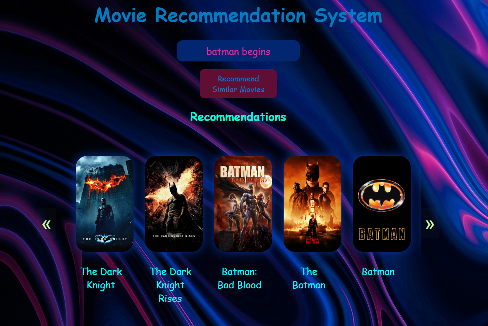

# Movie Recommender System

## Overview

This project is a Movie Recommender System that suggests similar movies based on user input. The system includes a web interface where users can type in a movie title and receive recommendations for similar movies. The recommendations are displayed along with their posters, and users can navigate through them.

## Features

- **Autocomplete Movie Search:** Users can type in the name of a movie and get autocomplete suggestions.
- **Recommendations:** Based on the selected movie, the system provides a list of similar movies.
- **Movie Posters:** Each recommended movie is displayed with its poster.
- **Navigation:** Users can scroll left and right to view more recommendations.

## Technologies Used

- **Frontend:** HTML, CSS, JavaScript, jQuery
- **Backend:** Flask (Python)
- **Data:** Movie dataset from TMDb 
- **Model:** CountVectorizer, cosine similarities and many other functions from scikit-learn library

## Setup and Installation

### Prerequisites

- Python 3.x
- Flask
- jQuery

### Installation

1. **Clone the repository:**

    ```bash
    git clone https://github.com/your-username/movie-recommender-system.git
    cd movie-recommender-system
    ```

2. **Install required Python packages:**

    ```bash
    pip install flask
    ```

3. **Run the Flask server:**

    ```bash
    python server.py
    ```

4. **Open your web browser and navigate to:**

    ```
    http://127.0.0.1:5000/
    ```
